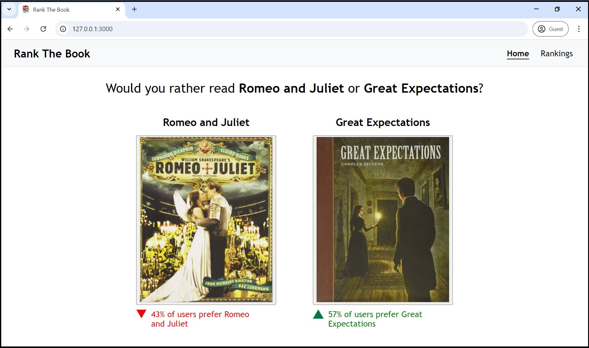
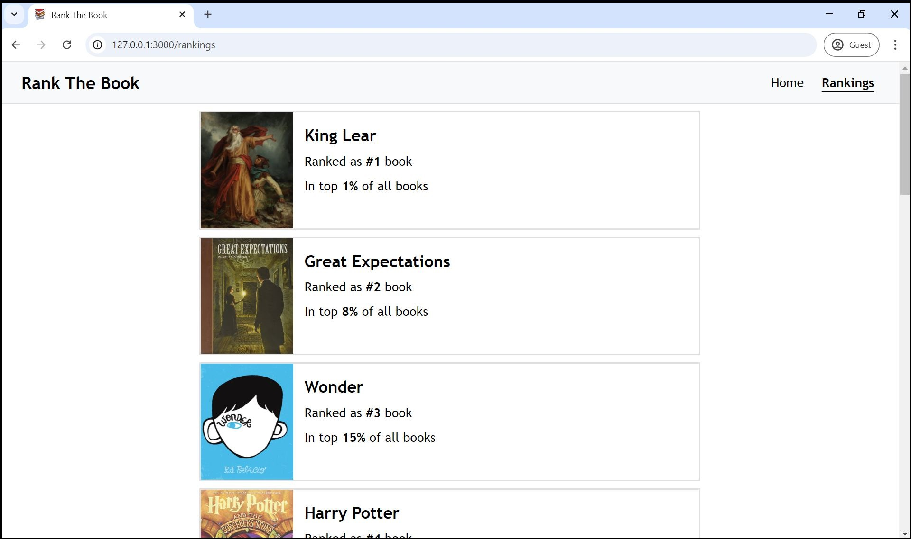

# Rank The Book
Rank The Book is a fullstack web application developed for readers to vote on their favourite literary works. With an innovative Elo rating framework, each book is assigned a relative popularity score that dynamically adjusts according to user votes, always updating to reflect the evolving preferences of the platform's community.

The application was built with Ruby on Rails due to its streamlined approach to web development, emphasizing convention over configuration and following the MVC (Model-View-Controller) architecture.

The integrated Elo book rating system includes the calculation of expected selection probabilities between books of different ratings, providing users with a unique experience as their votes influence and adjust the books' ratings according to these expected probabilities.

## Elo Rating System

Rank The Book implements a book rating system similar to the Elo rating mechanism, where each book is assigned an Elo rating that represents its popularity among users.

Given two books with ratings of $B_A$ and $B_B$, the probability that $B_A$ is selected over $B_B$ can be computed with the following equation.

### $E_A=\frac{1}{1+10^{\frac{B_B-B_A}{400}}}$

The probability that $B_B$ is selected over $B_A$ can be computed with the following equation.

### $E_B=\frac{1}{1+10^{\frac{B_A-B_B}{400}}}$

These equations involve an exponential function where the difference in ratings between books is divided by a scaling factor of 400. This simply assumes that for every 400-point difference in book ratings, the higher-rated book is expected to have approximately a tenfold advantage in its odds ratio compared to the lower-rated book.

As users vote between books, the expected win probabilities are compared with the voting outcomes. This adjusts the ratings of books according to the disparities between expected and actual results.

For instance, when a lower-rated book is selected over a higher-rated book, it experiences a higher rating boost (compared to being selected against a similarly rated book). This dynamic adjustment process ensures that user voting patterns accurately shape and adjust book ratings within the system.

## Final Result

  

  

## License
[MIT License](https://github.com/mat-ng/rank-the-book/blob/main/LICENSE)