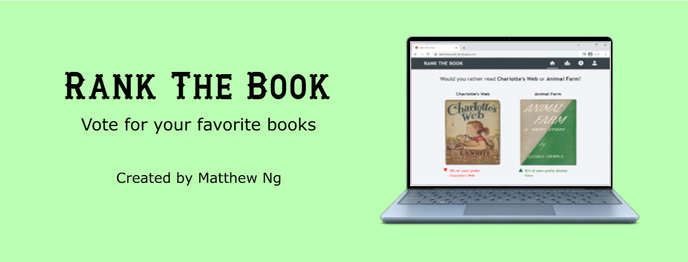

# Rank The Book

A video demo can be viewed [here](https://youtu.be/ZhpmpKUSLHE).

Rank The Book is a fullstack web platform developed for readers to share and vote on their favourite literary works. With an innovative Elo rating framework, each book is assigned a relative popularity score that dynamically adjusts according to user votes, always updating to reflect the evolving preferences of the platform's community.

The site was created using MERN stack to optimize the flexibility and scalability of the web application. User security and authentication were developed using JSON Web Tokens (JWTs) to encrypt user information throughout site interactions, while also restricting access to authorized user functionalities.

The integrated Elo book rating system includes the calculation of expected selection probabilities between books of different ratings, providing users with an interactive experience as their votes influence and adjust the books' ratings according to these expected probabilities.

## Inspiration

I've considered myself a pretty avid reader throughout my life. I particularly enjoy reading political theory, but have often noticed that I struggled to venture beyond this reading preference. This led to me brainstorming the idea to develop an application called Rank The Book. By creating a platform where users can share and vote for their favourite books, this could encourage readers not only to diversify their libraries, but also learn which books are most enjoyed by their peers.

## Goals

After getting inspired, I developed two main goals for this project:

1. Rank The Book should be developed as a scalable and resilient web application, so that the platform can deliver a seamless user experience while managing large volumes of of book data.

2. The platform should integrate an Elo rating system for books to support individual book ratings, expected selection probabilities between books, and adaptive adjustments to ratings based on user voting behaviours.

## Elo Rating System

Rank The Book implements a book rating system similar to the Elo rating mechanism, where each book is assigned an Elo rating that represents its popularity among users.

Given two books with ratings of $B_A$ and $B_B$, the probability that $B_A$ is selected over $B_B$ can be computed with the following equation.

### $E_A=\frac{1}{1+10^{\frac{B_B-B_A}{400}}}$

The probability that $B_B$ is selected over $B_A$ can be computed with the following equation.

### $E_B=\frac{1}{1+10^{\frac{B_A-B_B}{400}}}$

These equations involve an exponential function where the difference in ratings between books is divided by a scaling factor of 400. This simply assumes that for every 400-point difference in book ratings, the higher-rated book is expected to have approximately a tenfold advantage in its odds ratio compared to the lower-rated book.

As users vote between books, the expected win probabilities are compared with the voting outcomes. This adjusts the ratings of books according to the disparities between expected and actual results.

For instance, when a lower-rated book is selected over a higher-rated book, it experiences a higher rating boost (compared to being selected against a similarly rated book). This dynamic adjustment process ensures that user voting patterns accurately shape and adjust book ratings within the system.

## Final Result

A video demo can be viewed [here](https://youtu.be/ZhpmpKUSLHE).

  

  

  

  

## Future Roadmap

There are various different ways that Rank The Book can be improved:

1. Advanced recommendation algorithms could be implemented based on user preferences and voting patterns. This could improve book suggestions and encourage users to explore a wider range of titles.

2. Data analytics could be collected from user behaviour and engagement patterns with the platform. These could later be used as insights on how to improve the voting process and have it better align with user preferences.

## License

[Apache License 2.0](https://github.com/mat-ng/rank-the-book/blob/master/LICENSE)
