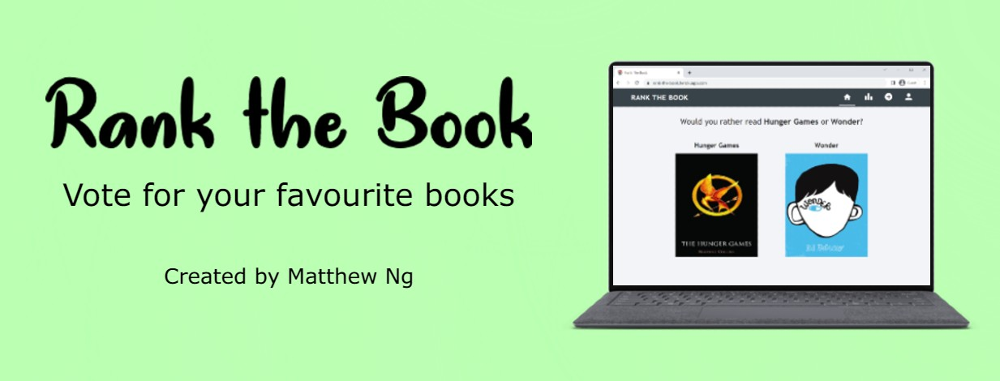

# Rank The Book

The app can be accessed [here](https://rank-the-book.herokuapp.com).

Rank The Book is fullstack web platform for users to vote and determine their favourite books. Users can create accounts to add or remove books, while also voting to influence the books' relative rankings.

The site was created using MERN stack to store user data, as well as [JSON web tokens](https://jwt.io) to handle user authentication.

## Inspiration

It's without a doubt that we all have our unique favourite books. However, I also wanted to figure out what other people thought of my personal favourites, compared to their own. Rank The Book provides users with this platform to share their favourite books, before users vote between books to determine every book's relative ranking.

## Goals

After getting inspired, I developed 2 main goals for this project:

1. Rank The Book should offer users an easy and intuitive way to vote between books.

2. Rank The Book should include a form of authentication before users can add or delete books from the application, so bots and other malicious attackers are avoided.

## Development

My first idea was to use JSON web tokens (JWT) to authenticate users when using the app. This would allow for the platform to check that new users have valid unexpired JWTs before they can create or delete books. And in order to obtain a valid unexpired JWT, users would be required to create a new account or login, thus avoiding bots and malicious attackers.

My second idea was to use a form of A/B testing for users to vote between books. Whenever voting, users would be shown 2 random books with the task of choosing which book they prefer. Then, the app would consider their choice and calculate both books' new relative rankings (compared to all other books). Altogether, this would create a simple voting experience for users, since they never have to choose between more than 2 books a time.

With these ideas in mind, I started developing Rank The Book. I created the database of books in MongoDB, so any book created or removed by users is stored effectively. Then, I coded the backend in Express, including the option for the client to request 2 random books at any given time. Additionally, I ensured that any request involving the creation or deletion of a book requires a valid unexpired JWT.

Then, I started coding the frontend in React. I created four subpages: a <em>home</em> page where users vote for books, a <em>rankings</em> page that shows all books' rankings, an <em>add</em> page where users can share their own books, and a sign-in page for users to login and obtain a new valid JWT.

## Final Result

Rank The Book can be accessed [here](https://rank-the-book.herokuapp.com).

  

  

  

  

## License

[Apache License 2.0](https://github.com/mat-ng/rank-the-book/blob/master/LICENSE)
