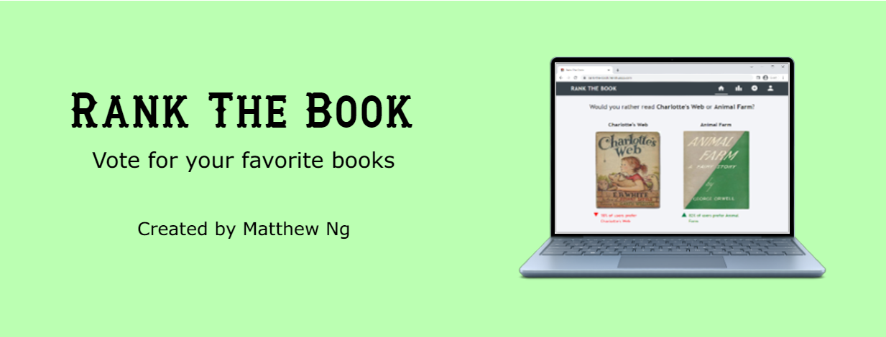
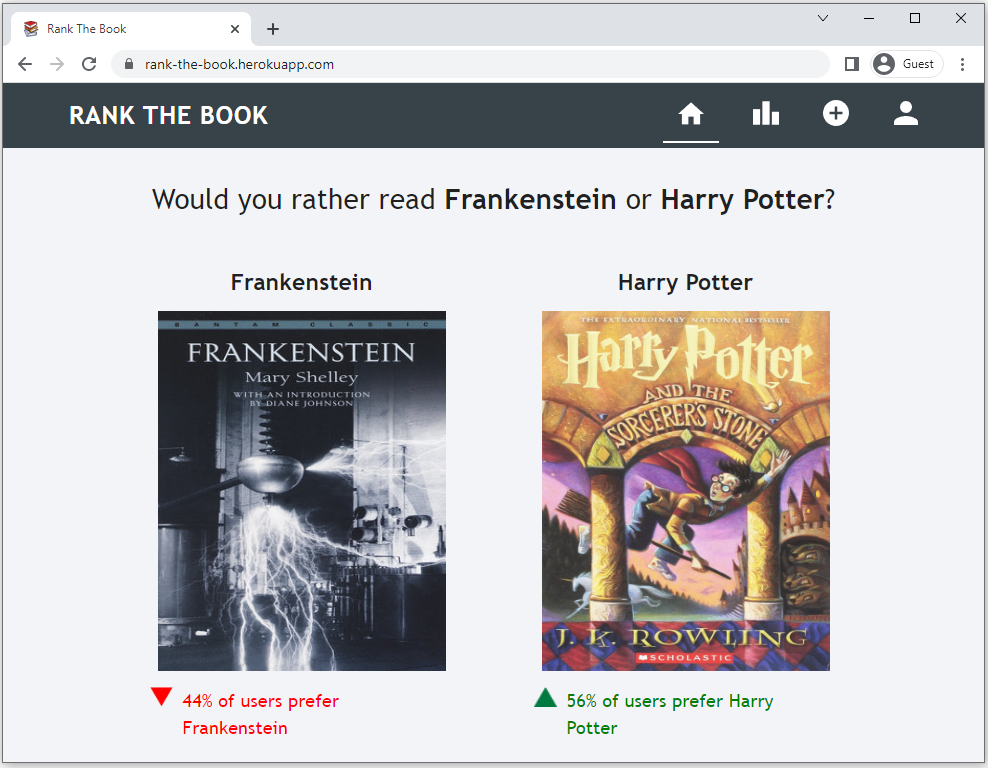
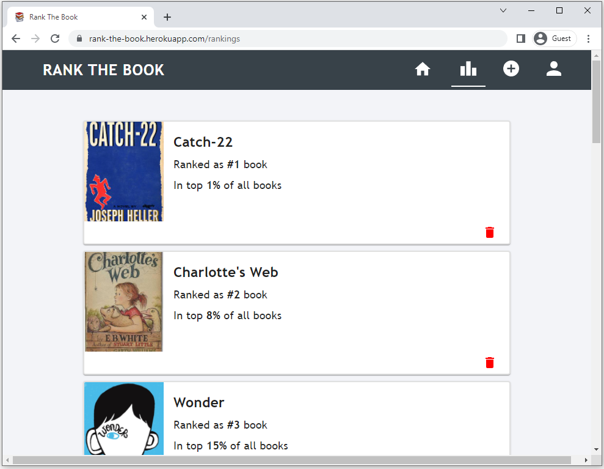
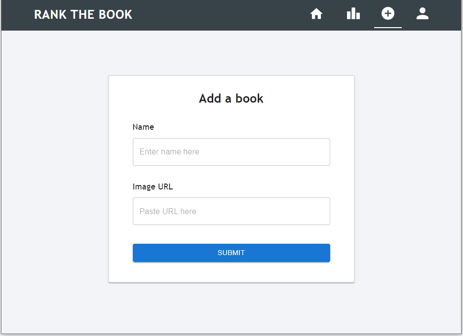
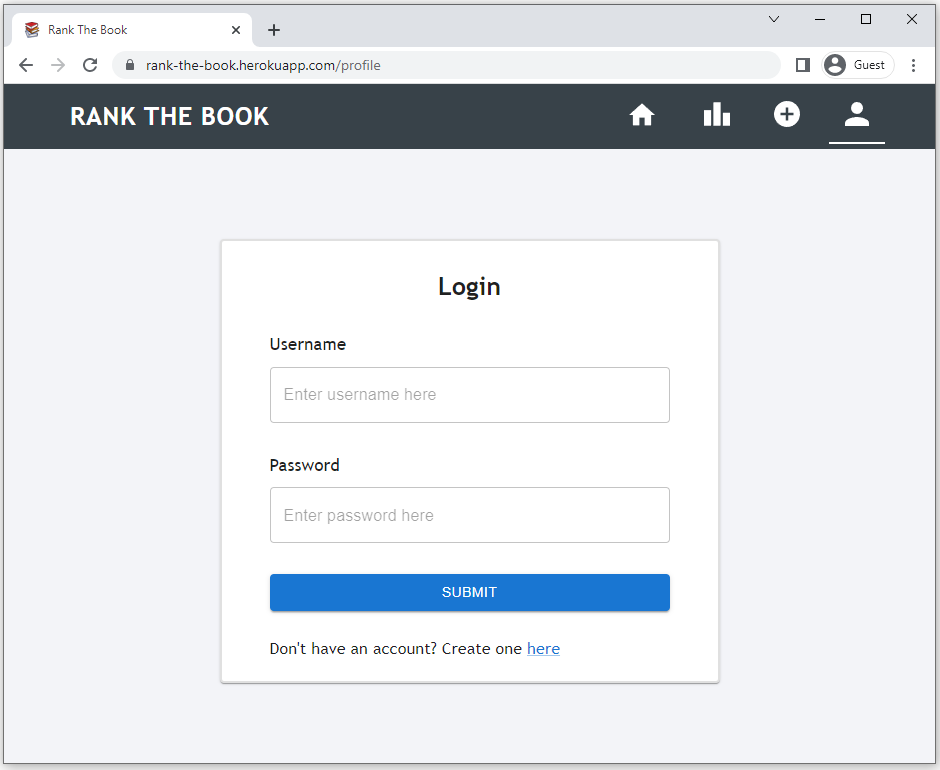

# Rank The Book

The app can be accessed [here](https://rank-the-book.herokuapp.com).

Rank The Book is a fullstack web platform for people to share and vote for their favorite books. Users can create accounts to add or remove their favorite books, while also voting to increase or decrease each book's ranking.

The site was created using MERN stack, as well as [JSON web tokens](https://jwt.io) to handle user authentication. The book voting system is an implementation of A/B testing in order to collect users' judgements of books.

## Inspiration

It's without a doubt that we all have our unique favorite books. However, I also wanted to figure out what other people thought of my personal favourites, compared to their own. Rank The Book provides users with this platform to share their favorite books, before users vote between books to determine every book's relative ranking.

## Goals

After getting inspired, I developed 2 main goals for this project:

1. Rank The Book should offer users an easy and intuitive way to vote between books.

2. Rank The Book should include a form of authentication before users can add or delete books from the application, so bots and other malicious attackers are avoided.

## Development

My first idea was to use JSON web tokens (JWT) to authenticate users when using the app. This would allow for the platform to check that new users have valid unexpired JWTs before they can create or delete books. And in order to obtain a valid unexpired JWT, users would be required to create a new account or login, thus avoiding bots and malicious attackers.

My second idea was to use a form of A/B testing for users to vote between books. Whenever voting, users would be shown 2 random books with the task of choosing which book they prefer. Then, the app would consider their choice and calculate both books' new relative rankings (compared to all other books). Altogether, this would create a simple voting experience for users, since they never have to choose between more than 2 books a time.

With these ideas in mind, I started developing Rank The Book. I created the database of books in MongoDB, so any book created or removed by users is stored effectively. Then, I coded the back-end in Express, including the option for the client to request 2 random books at any given time. Additionally, I ensured that any request involving the creation or deletion of a book requires a valid unexpired JWT.

Then, I started coding the front-end in React. I created four subpages: a <em>home</em> page where users vote for books, a <em>rankings</em> page that shows all books' rankings, an <em>add</em> page where users can share their own books, and a sign-in page for users to login and obtain a new valid JWT.

## Final Result

Rank The Book can be accessed [here](https://rank-the-book.herokuapp.com).

  

  

  

  

## Future Roadmap

There are various different ways that Rank The Book can be improved:

1. After authentication, users' JWTs are being stored in local storage (i.e. inside users' browsers). However, this is not secure because local storage is not protected from cross-site scripting (XSS) attacks, meaning that malicious users could possibly inject Javascript code into the app to steal user data. To improve this, I could look into storing JWTs in cookies, which have security flags to protect from XSS attacks.

2. The app does not currently provide support for users to recover their accounts (if they forget their username and/or password). As such, I could implement an option for users to connect an email with their accounts, so the app could email them links to reset their usernames or passwords accordingly.

## License

[Apache License 2.0](https://github.com/mat-ng/rank-the-book/blob/master/LICENSE)
